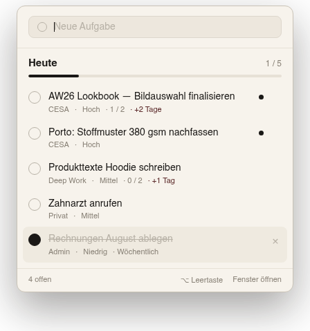
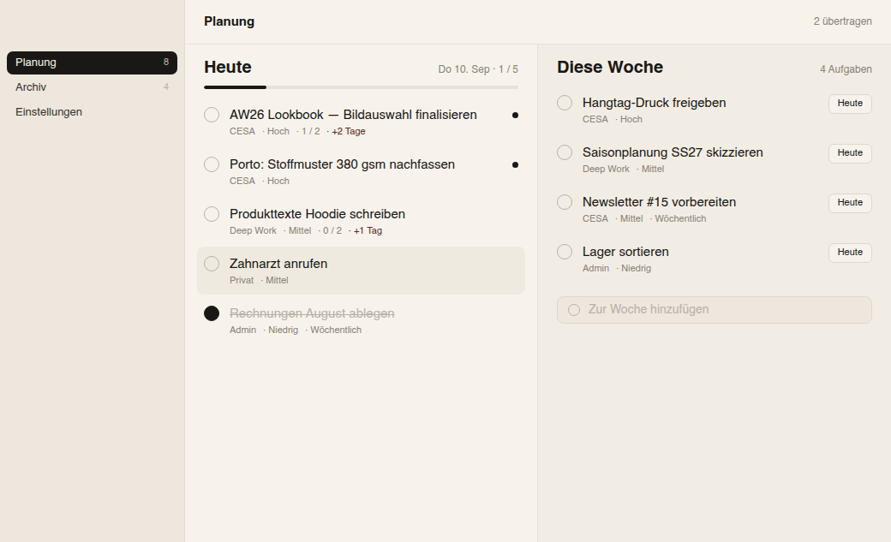
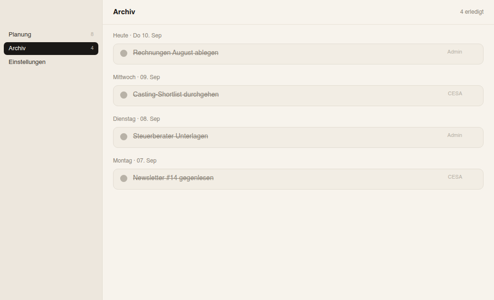
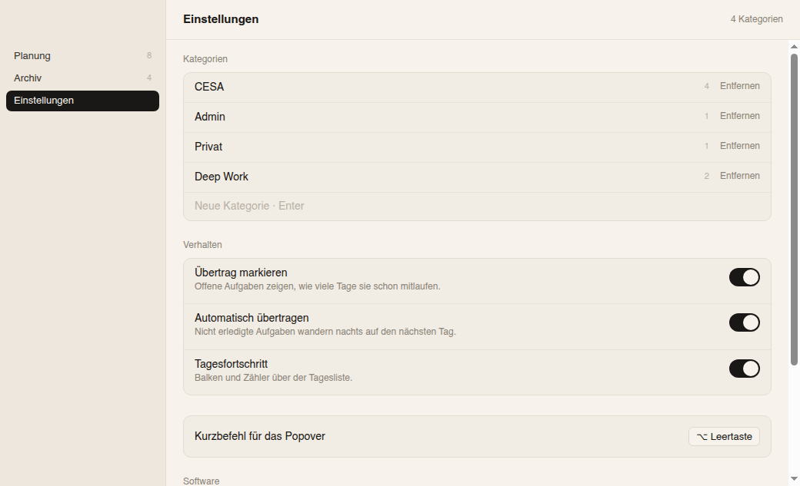

# Checkbar — Menübar-App für macOS

Umsetzung des Designs **„Todo Menubar v3 Apple"** aus dem Claude-Design-Handoff
(`../project/Todo Menubar v3 Apple.dc.html`) als lauffähige Electron-App, seit
Version 1.2 unter dem Namen **Checkbar**.

Zwei Oberflächen, genau wie im Entwurf:

- **Menübar-Popover** (400 px) — Aufgabe eintippen, Kategorie/Priorität/Ziel/Wiederholung
  wählen, Tagesliste abhaken. Öffnet über das Menübar-Symbol oder **⌥ Leertaste**.
- **Fenster** — Seitenleiste mit Planung / Archiv / Einstellungen, zweispaltige
  Tagesplanung („Heute" und „Diese Woche").

<p>
  
  
</p>
<p>
  
  
</p>

## Starten

**Fertige `.dmg`:** [Releases](../../releases) → neueste Version herunterladen,
öffnen, `Checkbar.app` nach `/Applications` ziehen.

**Aus dem Quellcode:**

```bash
npm install
npm start          # leere Liste, vier Standardkategorien
npm run demo       # beim allerersten Start mit den Beispieldaten aus dem Entwurf
```

`npm start` öffnet kein Fenster — die App lebt in der Menübar. Klick auf das Symbol
öffnet das Popover, Rechtsklick das Fenster, **⌥ Leertaste** schaltet das Popover um.

Die App ist als `LSUIElement` gebaut, erscheint also nicht im Dock — außer solange
das Fenster offen ist.

## Ein Release veröffentlichen

```bash
npm run dist
```

Baut `app/dist/Checkbar-<Version>-arm64.dmg` (electron-builder, Icon aus
`build/icon.png`). Dann auf GitHub: **Releases → Draft a new release** → Tag
`vX.Y.Z` → die `.dmg` reinziehen → veröffentlichen. Version vorher in
`package.json` hochzählen, damit der Update-Check in der App (siehe unten)
merkt, dass es etwas Neues gibt.

Wer die `gh`-CLI installiert hat, kann das auch in einem Rutsch:

```bash
gh release create v$(node -p "require('./package.json').version") \
  app/dist/*.dmg --title "Checkbar $(node -p "require('./package.json').version")" \
  --generate-notes
```

## Was implementiert ist

| Wunsch aus dem Chat | Umsetzung |
| --- | --- |
| Schneller Eintrag aus der Menübar | Popover am Menübar-Symbol, global über ⌥ Leertaste, Enter legt an |
| Tag und Woche planen | „Heute" und „Diese Woche" nebeneinander, `Heute`-Knopf holt aus der Woche herüber |
| Unerledigtes wandert auf den nächsten Tag | Übertrag beim Tageswechsel, im Minutentakt geprüft — auch wenn die App durchläuft |
| Übertrag sichtbar markiert | „+2 Tage" in Oxblood (`#5C2A2A`), abschaltbar |
| Eigene Kategorien | In den Einstellungen anlegen und entfernen, mit Zähler offener Aufgaben |
| Drei Prioritätsstufen | Hoch / Mittel / Niedrig, „Hoch" zusätzlich mit Punkt am Zeilenende |
| Notiz und Unteraufgaben | Klick auf den Aufgabentext klappt beides auf |
| Wiederkehrende Aufgaben | Täglich / Wöchentlich — beim Abhaken entsteht die nächste Instanz |
| Erledigt-Archiv | Nach Tagen gruppiert; Klick auf den Punkt öffnet eine Aufgabe wieder, Löschen-Symbol entfernt endgültig |
| Tagesfortschritt | Zähler und Balken, abschaltbar |
| Aufgaben löschen | Löschen-Symbol (×) erscheint beim Hover über eine Zeile — Popover, Heute, Diese Woche, Archiv |
| Aufgeräumte Eingabe | Kategorie/Priorität/Ziel/Wiederholung erscheinen erst, sobald Text im Feld steht — im Popover wie im Fenster |
| Update per Klick | Einstellungen → Software: Versionscheck gegen GitHub, „Update installieren" zieht/baut/ersetzt/startet neu, im Hintergrund |

Alles liegt in einer JSON-Datei unter
`~/Library/Application Support/Checkbar/todo.json` (atomar geschrieben, kein
Server, keine Cloud).

## Aufbau

```
build/
  icon.png    1024×1024-Icon (electron-builder wandelt es beim Bauen in .icns um)
src/
  main/       Electron-Hauptprozess: Tray, Popover, Fenster, Menü, Persistenz
    index.js      Fenster/Tray/Kurzbefehl/Menü, IPC, Tageswechsel-Wächter
    store.js      Laden, Speichern, Abonnenten
    sampleData.js Beispieldaten für `npm run demo`
    update.js     Versionscheck gegen GitHub (reines Node, kein Electron)
    selfUpdate.js Ein-Klick-Installieren: pull, bauen, ersetzen, neu starten (reines Node)
  preload/    contextBridge — der einzige Weg vom Renderer zum Store
  renderer/   Popover und Fenster (reines HTML/CSS/JS, kein Build-Schritt)
    base.css      Designtokens und geteilte Bausteine
    dom.js        Mini-Helfer plus die Aufgabenzeile beider Oberflächen
  shared/     Reine Logik, von Haupt- und Renderprozess genutzt
    model.js      Zustand, Aktionen, Übertrag, Ableitung der Ansicht
    dates.js      Deutsche Datumsformate
scripts/      Tests und Screenshot-Werkzeug
```

Die Renderer haben keinen Node-Zugriff (`contextIsolation`, `nodeIntegration: false`,
Content-Security-Policy) und reden ausschließlich über `window.todo` mit dem
Hauptprozess. Der Zustand liegt komplett im Hauptprozess; die Renderer bekommen ihn
bei jeder Änderung geschickt und rechnen sich daraus ihre Ansicht aus. Popover und
Fenster bleiben so automatisch im Gleichschritt.

Der App-Name steckt nur in `package.json` (`productName`) — alles andere (Menüs,
Fenstertitel, `/Applications/<Name>.app`, der kopierbare Update-Befehl) liest ihn
zur Laufzeit über `app.getName()` aus. Eine erneute Umbenennung ist also eine
Ein-Zeilen-Änderung, kein Suchen-und-Ersetzen im ganzen Code.

## Tests

```bash
npm test           # Zustandslogik (node) + End-to-End durch die echten Renderer (electron)
npm run shots      # rendert beide Oberflächen nach shots/
```

Unter Linux brauchen die Electron-Teile einen X-Server: `xvfb-run -a npm test`.

## Update-Check und Ein-Klick-Installieren

Einstellungen → Software → **„Nach Updates suchen"** vergleicht die eigene Versionsnummer
mit `app/package.json` auf dem `todo-menubar-app`-Branch bei GitHub — nur auf Klick,
kein automatischer Hintergrund-Check.

Ist ein Update da, erscheint **„Update installieren"**. Ein Klick, und im Hintergrund
läuft (mit Live-Log in der Karte, für den Fall dass mal etwas schiefgeht):

1. `git pull --ff-only` im Projektordner (Einstellungen → „Projektordner", Standard `~/ToDoBar`)
2. `npm install` und `npx electron-builder --mac` in `app/` — voller Build, nicht nur
   `--dir`, damit dabei gleich auch die `.dmg` für einen Release mit entsteht. Die App läuft
   während des Bauens normal weiter, es wird nichts Live-Laufendes angefasst
3. erst danach: App beenden, `/Applications/Checkbar.app` ersetzen, neu öffnen — das läuft
   als eigenständiges, vom Hauptprozess losgelöstes Skript, übersteht also dessen Beenden

Kein signiertes Auto-Update im Apple-Sinn — dafür bräuchte es eine kostenpflichtige
Entwickler-Signierung. Der Unterschied hier: Es ist derselbe lokale
Neu-bauen-und-Ersetzen-Schritt, den man sonst von Hand im Terminal macht, nur per Klick
angestoßen und ohne dass man selbst tippen muss. Da die neu gebaute `.app` lokal entsteht
(nicht heruntergeladen), setzt macOS in der Regel keine Quarantäne-Markierung — die
Rechtsklick-→-Öffnen-Hürde vom allerersten Start taucht bei diesen Selbst-Updates meist
nicht wieder auf.

Für den Fall, dass der automatische Weg mal nicht passt (anderer Projektordner,
Berechtigungsproblem, kein `git`/`npm` im PATH der Login-Shell): **„Befehl manuell
kopieren"** legt denselben Ablauf als Ein-Zeiler in die Zwischenablage — einfügen, Enter.

**Privates Repo:** `matchbutler-crypto/ToDoBar` ist nicht öffentlich lesbar, daher
schlägt allein der *Versionscheck* ohne Token mit einer klaren Fehlermeldung fehl (`git
pull` für den Install-Knopf nutzt die eigenen, bereits im Terminal hinterlegten
Zugangsdaten und ist davon unabhängig). Ein Feingranular-Token mit **nur Lesezugriff auf
genau dieses Repo** (GitHub → Settings → Developer settings → Fine-grained tokens) trägst
du im Einstellungen-Feld ein. Beide Felder — Token und Projektordner — bleiben
ausschließlich lokal in derselben `todo.json` wie die Aufgaben.

## Abweichungen vom Prototyp

Bewusst und begründet:

- **Fensterknöpfe.** Der Entwurf malt drei farbige Punkte in die Seitenleiste. Die App
  nutzt stattdessen die echten macOS-Knöpfe, exakt an dieselbe Stelle gesetzt
  (`trafficLightPosition: { x: 16, y: 20 }`) — sie sollen ja schließen und minimieren.
- **Menüleiste.** Der Entwurf zeigt eine nachgebaute Menübar („Todo · Datei · Bearbeiten ·
  Ansicht"). Daraus ist ein echtes Programmmenü mit demselben Aufbau geworden.
- **Datum.** Statt des festen „Do 10. Sep" rechnet die App mit dem echten Datum, in
  derselben Schreibweise.
- **Rahmen und Schatten des Fensters** kommen unter macOS vom System, nicht aus CSS.
- **App-Icon.** Der Entwurf hatte keins vorgesehen — für einen echten Release gehört
  eins dazu: ein abgerundetes Quadrat in Ink (`#1A1816`) mit einem Häkchen in Paper
  (`#F7F3EC`), aus derselben Palette wie der Rest.

Farben, Maße, Abstände, Schriftgrößen und Helvetica sind unverändert aus dem Entwurf
übernommen.

## Offene Punkte

- Der Prototyp kennt einen Umschalter `prioritySystem` („drei Stufen" / „flag"). Im Chat
  hast du dich für drei Stufen entschieden, deshalb ist nur das eingebaut.
- Die App ist nicht signiert und nicht notarisiert. Beim ersten Start meldet sich
  Gatekeeper; für den Eigengebrauch reicht Rechtsklick → Öffnen.
- Autostart bei der Anmeldung läuft über die systemeigenen Anmeldeobjekte
  (Systemeinstellungen → Allgemein → Anmeldeobjekte & Erweiterungen), kein Schalter in
  der App nötig.
